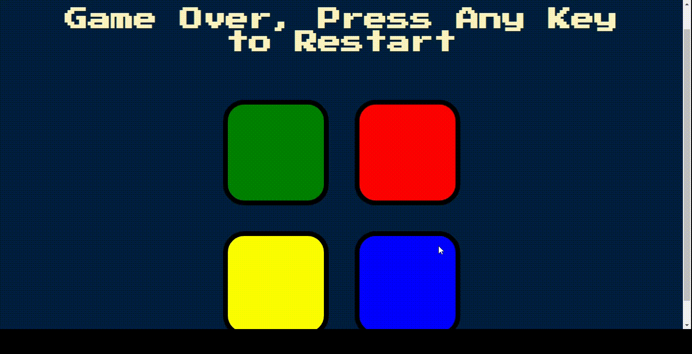

# Simon Game

Welcome to the Simon Game project! This is a web-based implementation of the classic memory game "Simon," where players must repeat increasingly long sequences of lights and sounds.

## Table of Contents

- [Introduction](#introduction)
- [Features](#features)
- [Technologies Used](#technologies-used)
- [Setup](#setup)
- [How to Play](#how-to-play)
- [Contributing](#contributing)
- [License](#license)

## Introduction

The Simon Game is a fun and interactive memory game that challenges players to remember and repeat a sequence of colors. The sequence gets progressively longer and more challenging as the game advances. This project is a simple yet engaging way to practice memory skills.

## Features

- Interactive game interface with four colored buttons.
- Randomly generated sequences that players must repeat.
- Visual and audio feedback for player interactions.
- Increasing difficulty with each level.
- Game over detection and restart functionality.

## Technologies Used

- **HTML**: Provides the structure of the game.
- **CSS**: Styles the game interface for an appealing look.
- **JavaScript (jQuery)**: Implements the game logic and interactivity.

## Setup

To set up and run this project locally, follow these steps:

1. **Clone the repository**:
    ```bash
    git clone https://github.com/your-username/simon-game.git
    ```

2. **Navigate to the project directory**:
    ```bash
    cd simon-game
    ```

3. **Open the `index.html` file in your browser**:
    - You can simply double-click the `index.html` file, or
    - Use a live server extension in your code editor for a better development experience.

## How to Play

1. Open the game in your web browser.
2. Press any key to start the game.
3. Watch the sequence of colors flashed by the game.
4. Repeat the sequence by clicking on the colored buttons.
5. If you correctly repeat the sequence, the game will add another color to the sequence and move to the next level.
6. If you make a mistake, the game will end, and you can press any key to restart.

## Contributing

Contributions are welcome! If you would like to contribute to this project, please follow these steps:

1. **Fork the repository**:
    - Click the "Fork" button on the upper right corner of the repo page.
2. **Clone your forked repository**:
    ```bash
    git clone https://github.com/your-username/simon-game.git
    ```
3. **Create a new branch**:
    ```bash
    git checkout -b feature-branch-name
    ```
4. **Make your changes** and **commit them**:
    ```bash
    git commit -m 'Add some feature'
    ```
5. **Push to the branch**:
    ```bash
    git push origin feature-branch-name
    ```
6. **Open a pull request**: Describe your changes and submit the pull request for review.

## License

This project is licensed under the MIT License. See the [LICENSE](LICENSE) file for more details.

---

Feel free to modify this template to better fit your specific project details and repository structure.


### Sample Screenshot

